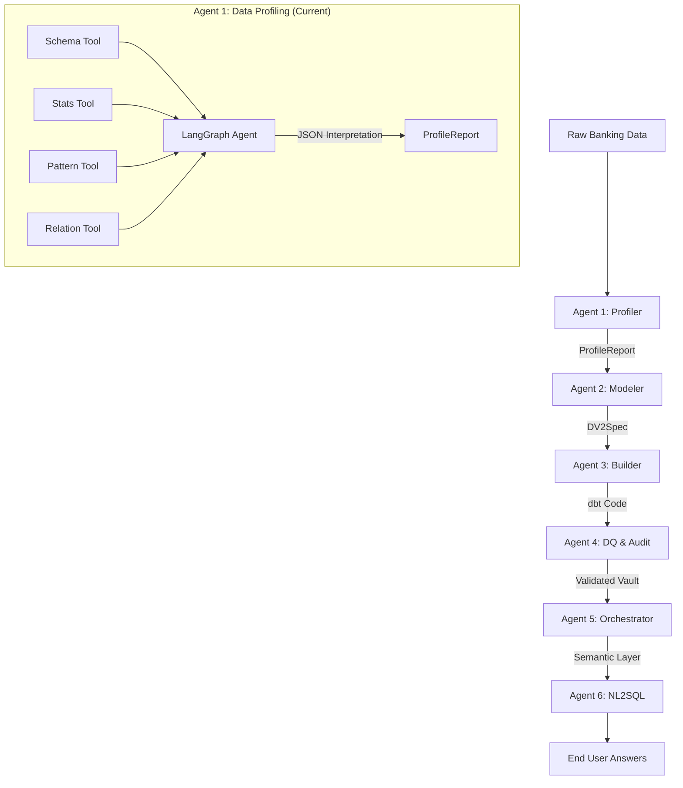

# Banking AI Agent Platform — Data Profiling Agent

[](https://opensource.org/licenses/MIT)
[](https://www.python.org/downloads/release/python-3110/)
[](https://langchain-ai.github.io/langgraph/)
[](https://spark.apache.org/docs/latest/api/python/index.html)

A production-grade, end-to-end agentic data pipeline built on **Databricks** and **Delta Lake**. This platform autonomously transforms raw synthetic banking data into a governed, semantic layer using a multi-agent system powered by **LangGraph** and **Gemini Flash**.

> **Note:** This repository specifically implements **Agent 1: The Data Profiling Agent**, the first stage of the 6-agent pipeline.

---

## 🌟 Platform Vision

Raw banking data (CSV/Parquet/Delta) is ingested and autonomously:
1.  **Profiles** schema, stats, and business key candidates (Agent 1).
2.  **Models** Data Vault 2.0 entity design (Agent 2).
3.  **Builds** dbt-databricks vault code (Agent 3).
4.  **Validates** via DQ rules and audit trails (Agent 4).
5.  **Orchestrates** statefully with human-in-the-loop checkpoints (Agent 5).
6.  **Serves** answers via NL2SQL on Unity Catalog (Agent 6).

---

## 🏗️ Architecture: Multi-Agent Topology



---

## 🚀 Quick Start (Local Development)

Get the profiling agent running locally in minutes using Docker.

### 1. Prerequisites
- Docker & Docker Compose
- Google AI Studio API Key (for Gemini Flash)

### 2. Setup
```bash
# Clone the repository
git clone https://github.com/sathish-thandhari/banking-profiling-agent.git
cd banking-profiling-agent

# Create environment file
cp .env.example .env
# Edit .env and add your GEMINI_API_KEY
```

### 3. Launch
```bash
docker-compose up --build
```
- **FastAPI:** [http://localhost:8000/docs](http://localhost:8000/docs)
- **Streamlit UI:** [http://localhost:8501](http://localhost:8501)
- **Spark UI:** [http://localhost:4040](http://localhost:4040)

---

## 🛠️ Tech Stack

- **Orchestration:** LangGraph (Stateful Agent Workflows)
- **LLM:** Gemini 2.5 Flash (via LiteLLM)
- **Compute:** PySpark 3.5.0
- **Storage:** Delta Lake (Local & Databricks)
- **API:** FastAPI
- **UI:** Streamlit
- **Observability:** Structlog & MLflow

---

## 📖 Documentation Portal

For deeper dives into the system, visit our [Documentation Index](docs/index.md):

- **[Architecture Deep-Dive](docs/architecture.md):** How the profiling agent reasons about data.
- **[API Reference](docs/api-reference.md):** Integration details for the `POST /profile` endpoint.
- **[Databricks Deployment](docs/deployment.md):** Porting the agent to run natively on Databricks.
- **[Tutorial: Profile Your First Table](docs/tutorial.md):** A step-by-step guide for developers.

---

## 🤝 Contributing

Contributions are welcome! Please see our [Contributing Guide](CONTRIBUTING.md) and check out the [Issue Tracker](https://github.com/sathish-thandhari/banking-profiling-agent/issues).

---

## 📄 License

This project is licensed under the MIT License - see the [LICENSE](LICENSE) file for details.
