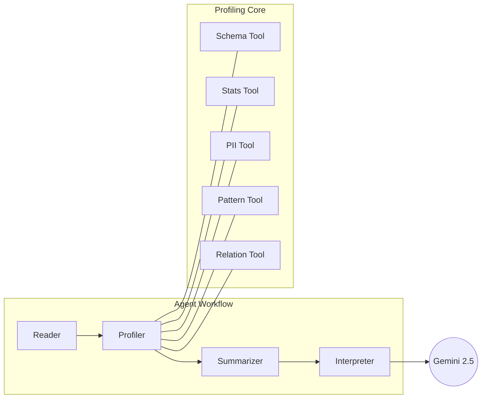

# 🏦 Data Profiling Agent


**Modern, AI-driven data profiling and interpretation for Delta Lake and more.**

The **Data Profiling Agent** is an intelligent system that automates the complex task of understanding large datasets. By combining the scale of **PySpark** with the reasoning power of **Gemini 2.5 Flash**, it transforms raw statistics into human-readable insights, detects sensitive PII, and infers cross-table relationships.

---

## ✨ Key Features

- **🤖 AI interpretation:** Automatically generates entity descriptions, data quality (DQ) flags, and primary key analysis.
- **🛡️ PII Detection:** High-performance detection of sensitive data using Spark-native functions.
- **🔗 Relationship Discovery:** Infers potential foreign key relationships across your entire Delta Lake.
- **📈 Pattern Matching:** Extensible regex-based pattern detection for domain-specific identifiers.
- **🚀 Scalable Profiling:** Built-in sampling guards and caching to handle datasets with millions of rows.
- **🔌 Flexible Interfaces:** Both a developer-friendly **FastAPI** and a user-friendly **Streamlit UI**.

---

## 🏗️ Architecture

The agent uses a structured **LangGraph** workflow to ensure reliability and deterministic execution of profiling tools.



---

## ⚡ Quick Start

```bash
# Clone the repository
git clone <repository_url> && cd data-profiling-agent

# Set up environment
cp .env.example .env

# Launch with Docker
docker-compose up -d
```
Visit http://localhost:8501 to start profiling!

---

## 📖 Documentation Portal

Explore our detailed documentation following the Diátaxis framework:

| Section | Description |
| --- | --- |
| 🚀 [**Tutorials**](./docs/tutorial.md) | Step-by-step guides for getting started and batch profiling. |
| 🛠️ [**How-To Guides**](./docs/how-to-guides.md) | Guides for custom patterns, data connections, and LLM setup. |
| 📚 [**Reference**](./docs/api-reference.md) | Technical specs for API endpoints, models, and profiling tools. |
| 🧠 [**Explanation**](./docs/explanation.md) | Deep dives into the agent's architecture and design decisions. |

---

## 🛠️ Tech Stack

- **Core Engine:** Python 3.10+, LangGraph, LiteLLM
- **Data Engine:** PySpark, Delta Lake
- **API:** FastAPI, Uvicorn
- **UI:** Streamlit
- **Quality:** Pytest, Structlog

---

[← Return to Documentation Index](./docs/index.md)
