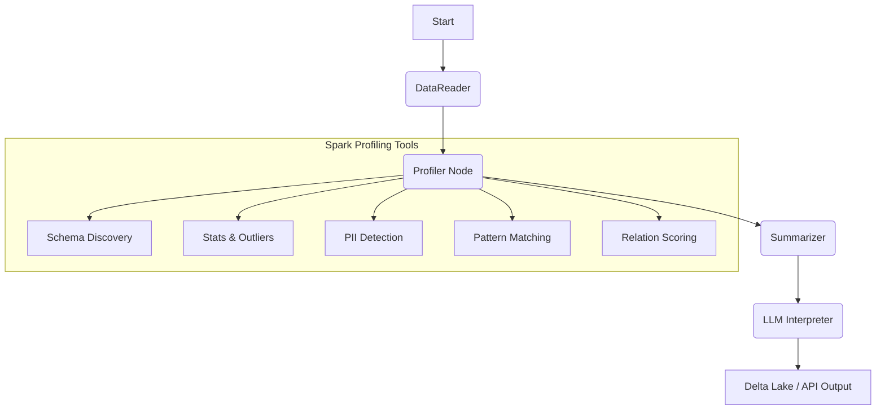

# Data Profiling Agent (Agent 1 of 6)

An intelligent, autonomous profiling engine designed for banking-grade datasets. The Data Profiling Agent is the foundational layer of a 6-agent ecosystem for automated Data Vault 2.0 (DV2.0) modeling and pipeline generation.

[](https://www.loom.com/share/placeholder) <!-- Replace with actual Loom link -->

## 🎯 Core Mission & Vision

In modern banking environments, understanding raw data at scale is the primary bottleneck for data engineering. This agent automates the "Observation" phase of the data lifecycle. It uses **PySpark** for high-performance statistical analysis and **LLMs (Gemini Flash)** for semantic interpretation, producing versioned, immutable `ProfileReports` that serve as the ground truth for downstream modeling agents.

## 🔄 Architecture & Workflow

The agent utilizes a stateful **LangGraph** workflow to orchestrate complex data analysis tasks.



### 🛠 Key Capabilities

*   **Intelligent Profiling:** Single-pass Spark aggregations using HLL (HyperLogLog) for ultra-fast cardinality estimation on billions of rows.
*   **Hybrid PII Detection:** Combines high-speed Regex matching with semantic LLM sampling to identify sensitive data (SSN, IBAN, Names) without manual tagging.
*   **Cross-Table Relation Discovery:** Scores potential join keys between tables using containment-based HLL sketches, suggesting foreign key candidates.
*   **Semantic Interpretation:** Translates technical stats into human-readable entity descriptions, identifying business key (BK) candidates and data quality concerns.
*   **Regulatory Compliance by Design:** Every profile is stored in an **immutable Delta Lake table**, providing a permanent audit trail for RBI, SOX, and BASEL compliance.

## 🚀 Quick Start

### 1. Environment Setup
```bash
cp .env.example .env
# Edit .env with your GEMINI_API_KEY
```

### 2. Launch with Docker
```bash
docker compose up --build
```
*   **Streamlit UI:** `http://localhost:8501`
*   **FastAPI:** `http://localhost:8000`

### 3. Generate Sample Banking Data
```bash
python3 scripts/data_gen/ingest_data.py
```

## 📂 Documentation Portal

Explore the detailed guides for developers and users:

*   [**Tutorials**](docs/tutorials/getting-started.md): From installation to your first report.
*   [**How-to Guides**](docs/how-to/profile-new-data.md): Profiling custom sources and configuring patterns.
*   [**Architecture & Explanation**](docs/explanation/architecture.md): Deep dive into the LangGraph logic and Spark tools.
*   [**API & Data Reference**](docs/reference/api-reference.md): Technical specs for endpoints and the `ProfileReport` model.

## 🏗 Deployment Overview

### Local / Docker (Default)
Ideal for development and small-scale profiling. Uses a local Spark cluster and file-based Delta storage.

### Databricks Deployment
The agent is designed to be platform-agnostic. By swapping 3 lines of configuration, it can attach to a **Databricks SQL Warehouse** via `databricks-connect` and read directly from **Unity Catalog**. 
> See [Databricks Deployment Guide](docs/explanation/databricks-deployment.md) for details.

---
*Part of the [Agentic Data Engineering Architecture](https://github.com/placeholder-repo).*
