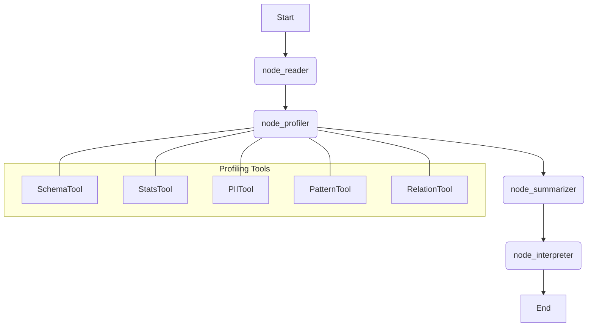

# 🧠 Explanation

Understand the architecture, design decisions, and core logic behind the **Data Profiling Agent**.

## 🏗️ Agent Architecture

The agent is built using **LangGraph**, which allows for a deterministic workflow of "nodes" while leveraging the reasoning capabilities of LLMs.

### Workflow Diagram

### Key Workflow Steps
1.  **`node_reader`**: Loads data using PySpark. For performance, it implements a **10M row sampling guard** (sampling down to 1M if necessary) and caches the DataFrame.
2.  **`node_profiler`**: Orchestrates the five specialized profiling tools. Each tool is designed to be independent and handles its own errors to ensure partial profiling success even if one tool fails.
3.  **`node_summarizer`**: A critical step for large schemas. LLMs have context limits; the summarizer identifies "interesting" columns (those with PII, high null rates, outliers, or PK candidates) to prioritize in the LLM prompt.
4.  **`node_interpreter`**: Formulates a detailed JSON prompt for the LLM. It maps the tool outputs into a structured format and asks the LLM to provide human-readable entity descriptions, DQ flags, and relationship analysis.

## 🔎 Interpretation Engine

The interpretation engine uses **Gemini 2.5 Flash** (by default) to synthesize low-level statistics into business-level insights.

### Fallback Mechanism
If the LLM call fails (e.g., API rate limits or network issues), the agent uses a **heuristic-based fallback**. This ensures that the report always contains a basic interpretation, even without AI synthesis.

## 🔒 Security & Privacy

### PII Detection
The `PIITool` utilizes Spark-native SQL expressions for high-performance detection across massive datasets. It targets sensitive fields such as:
- Emails
- Social Security Numbers (SSN)
- Credit Card Numbers
- Phone Numbers

### Data Sampling
To maintain speed and avoid overwhelming the Spark executor or LLM context, the agent intelligently samples large datasets. This ensures that profiling remains fast regardless of the source table size.

---

[← Back to Main Index](./index.md)
