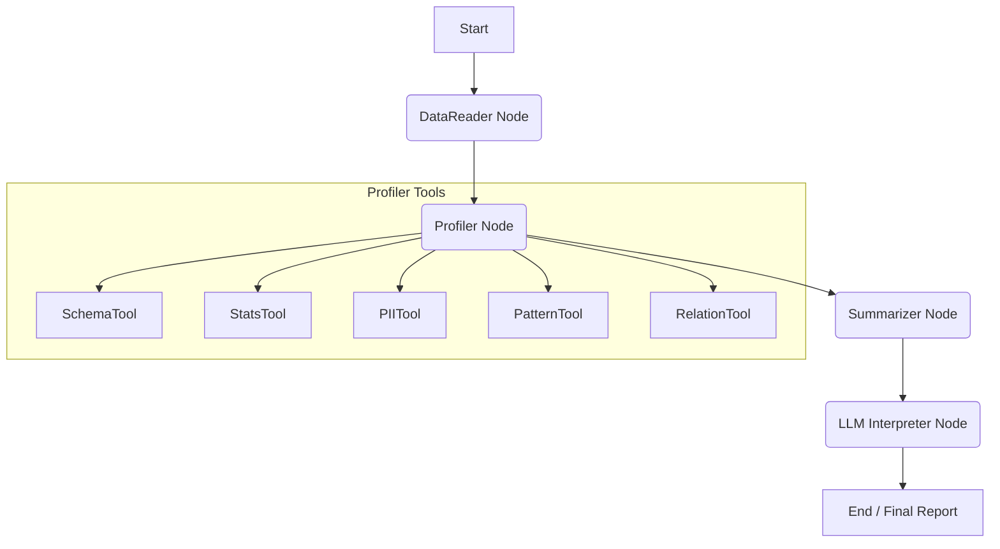

# Architecture: The Agentic Workflow

The Data Profiling Agent is built as a stateful, directed acyclic graph (DAG) using **LangGraph**. This architecture allows for a modular, robust, and extensible profiling process.

## 🔄 The Workflow Graph

The following diagram illustrates the lifecycle of a profiling job:

### 1. DataReader Node
- Responsible for initializing the Spark session and loading the target table.
- Supports multiple connection types: `file` (Delta, Parquet, CSV), `duckdb`, or custom Spark JDBC sources.
- **Smart Sampling:** Automatically detects tables with >10M rows and applies a 1M row sample to ensure efficient profiling while maintaining statistical relevance.

### 2. Profiler Node
- Executes a suite of Spark-based tools.
- Although the tools run sequentially in the code, Spark's lazy evaluation and distributed execution engine parallelize the actual data crunching.
- Each tool returns a specialized profile (e.g., `PIIProfile`, `StatsProfile`) which is added to the `AgentState`.

### 3. Summarizer Node
- Acts as a context manager for the LLM.
- If a table has many columns (e.g., >50), the Summarizer ranks them based on "interest" factors (PII detected, high null rate, outliers, PK candidate status).
- It selects the top ~30 most significant columns to include in the LLM prompt, ensuring we stay within token limits while providing the most relevant data.

### 4. LLM Interpreter Node
- Uses **LiteLLM** to call a configured LLM (e.g., Gemini 2.5 Flash, GPT-4).
- The LLM receives the technical stats and provides a human-readable interpretation:
    - **Suggested Entity Name:** A business-friendly name for the table.
    - **Business Key (BK) Candidates:** Recommendations for unique identifiers.
    - **PII Summary:** A concise overview of sensitive data findings.
    - **Data Quality (DQ) Flags:** Highlights high null rates, outliers, or schema inconsistencies.
- **Heuristic Fallback:** If the LLM is unavailable or fails, a rule-based heuristic generator provides a basic interpretation to ensure the report is still generated.

## 🛠️ Tech Stack Choices

- **LangGraph:** Chosen for its ability to handle complex agentic states and easy addition of new nodes or loops.
- **PySpark:** Essential for processing large-scale datasets that exceed local memory.
- **Delta Lake:** Provides ACID transactions and schema evolution for the persisted profiling reports.
- **LiteLLM:** Offers a unified interface to switch between different LLM providers (cloud or local) with minimal configuration changes.
